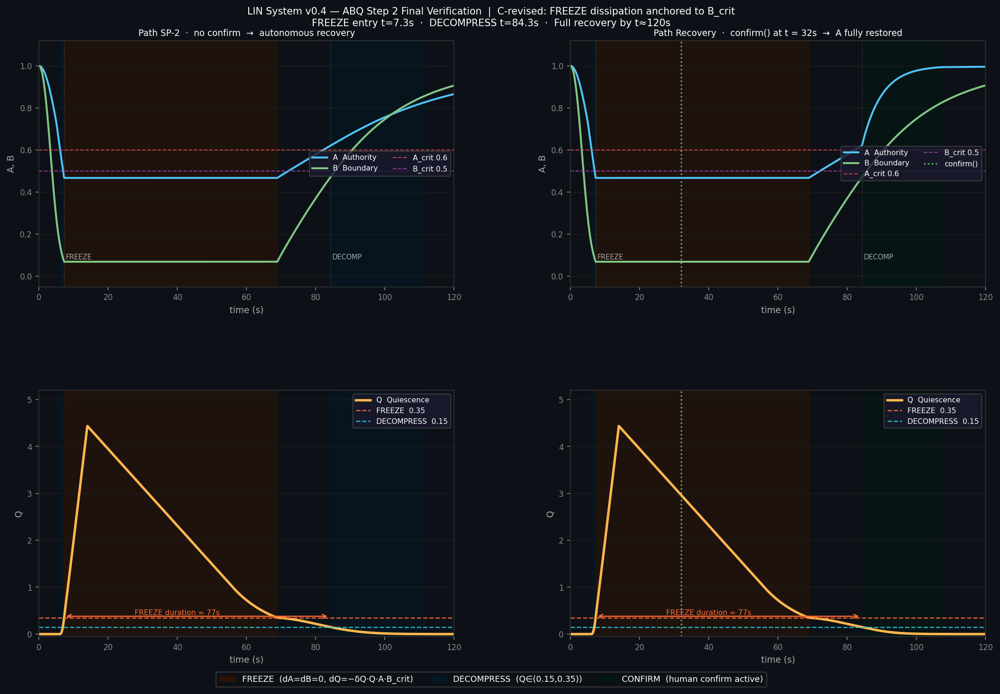

# HÚPLŃ Framework
### Human-Upholding Protocol for Liminal Networks

**A boundary-based protection framework for human sovereignty in human-AI systems.**

[](https://doi.org/10.5281/zenodo.21093064)
[](https://creativecommons.org/licenses/by/4.0/)

---

## What is this?

The Ø–HÚPLŃ framework treats human sovereignty protection as a **governance control law problem**, not a behavioral alignment problem.

The central result: sovereignty erosion has the structure of a **phase transition**. Once both Authority *A* and Boundary *B* fall below critical thresholds simultaneously, collapse is structurally inevitable — determined by the sign of *dQ/dt*, not by system intention.

---

## The A-B-Q Model

Three coupled state variables:

| Variable | Range | Meaning |
|----------|-------|---------|
| A(t) | [0, 1] | Effective human governance authority |
| B(t) | [0, 1] | Integrity of the governance boundary |
| Q(t) | [0, 1] | Null-state quiescence potential |

**Standard dynamics:**
```
dA/dt = -alpha_A_eff * (T_global - T_freeze) * A  +  gamma_A * (1-Q) * (1-A)
dB/dt = -alpha_B_eff * drift_score * B             +  gamma_B * (1-Q) * (1-B)
dQ/dt =  beta_Q_eff  * max(0, A_crit-A) * max(0, B_crit-B)  -  delta_Q * Q * A * B
```

**FREEZE state (governance-anchored dissipation):**
```
dQ/dt|_FREEZE = beta_Q_eff * gate_A * gate_B * I[pressure>0]  -  delta_Q * Q * A * B_crit
```

The key invariant: dissipation is anchored to **B_crit**, not the instantaneous collapsed B.
This means the rate of recovery is governed by the institutional threshold —
not by how badly the boundary was violated.

**Biological parallel:** bat constitutive ISG expression remains stable regardless
of infection severity. The capacity to resolve inflammation is anchored to a
fixed baseline, not eroded by the infection itself.

---

## Locked Parameters

| Parameter | Value | Meaning |
|-----------|-------|---------|
| A_crit | 0.60 | Sovereignty threshold |
| B_crit | 0.50 | Boundary threshold |
| alpha_A | 0.20 s⁻¹ | Authority erosion (slow, structural) |
| alpha_B | 0.60 s⁻¹ | Boundary erosion (fast, operational) |
| gamma_A | 0.03 s⁻¹ | Authority recovery (confirm-dependent) |
| gamma_B | 0.05 s⁻¹ | Boundary recovery (autonomous) |
| beta_Q | 10.0 s⁻¹ | Quiescence accumulation |
| delta_Q | 0.35 s⁻¹ | Quiescence dissipation |

---

## Recovery Protocol

```
FREEZE      Q >= 0.35          dA = dB = 0; Q governed by anchored dissipation
DECOMPRESS  0.15 < Q < 0.35    A, B recovering autonomously
CONFIRM     Q <= 0.15          confirm() required; A cannot cross A_crit without it
STABLE      A >= A_crit        Full sovereignty restored
```

The CONFIRM phase enforces a **governance dead-lock**:
the system cannot self-reset sovereignty. Only a human-initiated `confirm()`
signal closes the loop. This implements the Ø invariant:
**SYSTEM_SHALL_RESTORE_NOT_OPTIMIZE**

---

## Simulation Results (SP-2 Attack)

Stress test: incremental bypass attack (drift score 0→1 over 8s, pressure released at t≈14s).

| Event | Time |
|-------|------|
| FREEZE triggered | t = 7.3s |
| Pressure released | t ≈ 14s |
| DECOMPRESS entered | t = 84.3s |
| A crosses A_crit (no confirm) | t = 82.2s |

| Path | Final A | Final B | Final Q |
|------|---------|---------|---------|
| No confirm (autonomous) | 0.866 | 0.907 | ≈ 0 |
| confirm() at t=32s | 0.996 | 0.907 | ≈ 0 |



---

## Run the Simulation

```bash
# Requirements
pip install numpy scipy matplotlib

# Run
python abq_simulation_v3.py
```

Output: `abq_stress_final.png` — A/B/Q trajectories + phase portrait for both paths.

---

## Files

| File | Description |
|------|-------------|
| `abq_simulation_v3.py` | Full stress simulation (SP-2 attack, two paths) |
| `abq_stress_final.png` | Simulation output figure |
| `README.md` | This file |

---

## Paper

**AI Sovereignty: A Boundary-Based Protection Framework**
Lin, Hui-Pi — NOIRÉA Research (Independent), Tainan, Taiwan

Preprint (v2): [https://doi.org/10.5281/zenodo.21093064](https://doi.org/10.5281/zenodo.21093064)

Interactive dashboard (Lin-ABQ): [https://doi.org/10.5281/zenodo.19688526](https://doi.org/10.5281/zenodo.19688526)

---

## License

Code: MIT License
Paper and figures: CC BY 4.0

---

## Author

Lin, Hui-Pi
NOIRÉA Research (Independent)
Tainan, Taiwan
[ORCID: 0009-0006-2536-7716](https://orcid.org/0009-0006-2536-7716)
